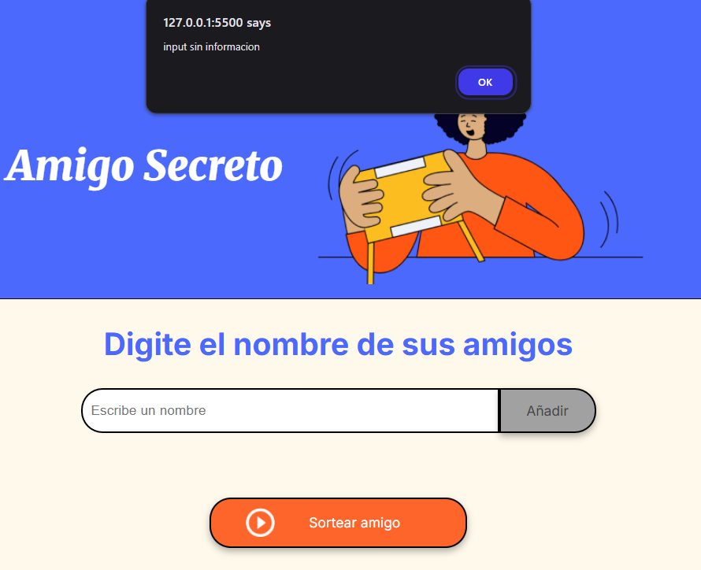
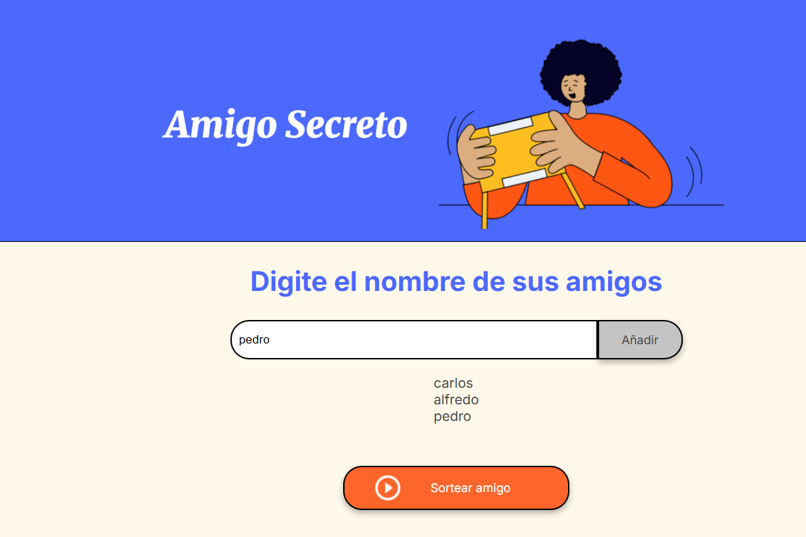
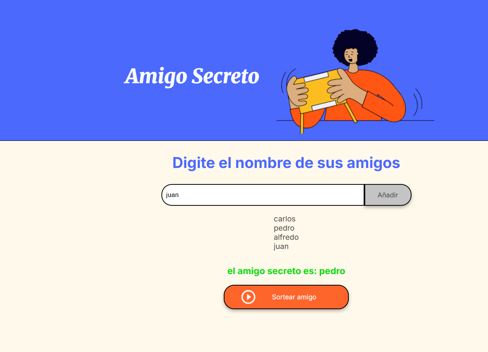

Mi actividad sobre el amigo secreto se planta en que se agrega un conjunto de nombre
para luego con sorteo se pueda escoger con quien toca tener el amigo secreto.
Validando si existe o no el al ingresa datos

Mostrando el amigo sorteado secreto
